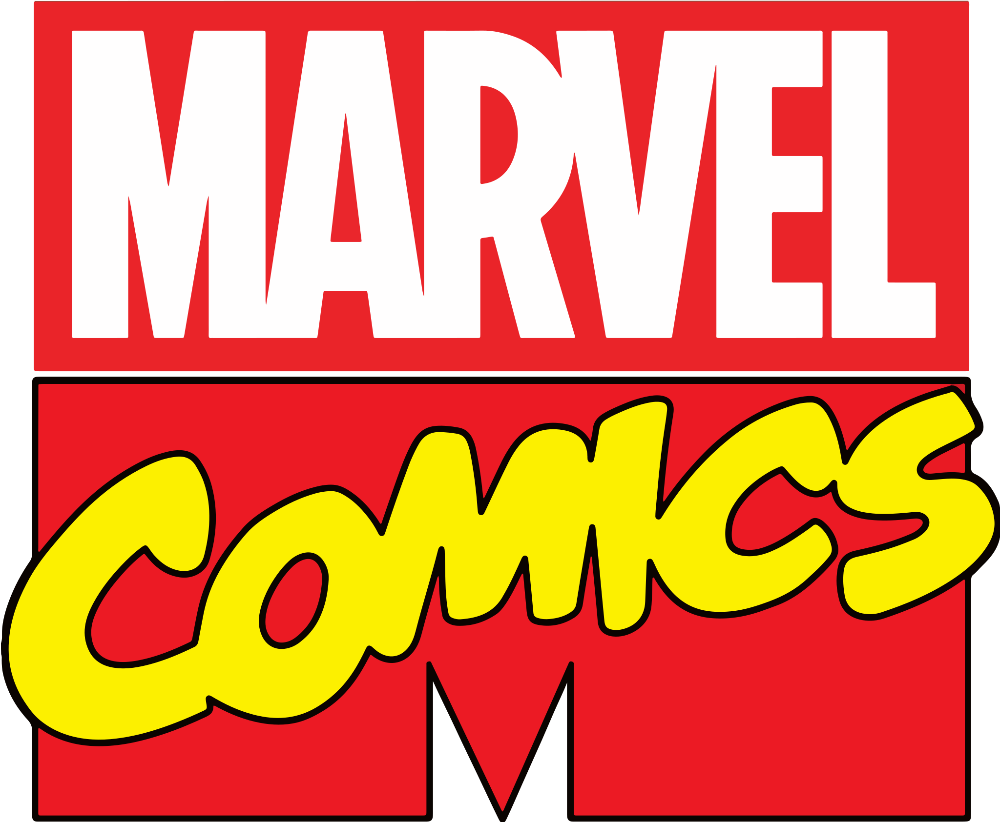

  

<h2>Consulta Quadrinhos (Comics) v2.0</h2>

Projeto Front-End <strong>(HTML, CSS, JavaScript, React, TypeScript e Material UI)</strong> com o objetivo de listar com detalhes todos as comics lançadas pela <strong>Editora Marvel</strong> até o ano atual, incluindo os nomes, ano de lançamento e autores de cada Comics, também tem uma página dedicada à todos os heróis, listadas em ordem alfabética.

<h3>Tecnologias Utilizadas</h3>

-  [React](https://reactjs.org/) – Javascript UI Libraries
-  [JavaScript](https://developer.mozilla.org/en-US/docs/Web/JavaScript) – Languages
-  [TypeScript](http://www.typescriptlang.org) – Languages
-  [ESLint](http://eslint.org/) – Code Review
-  [React Router](https://github.com/rackt/react-router) – JavaScript Framework Components
-  [axios](https://github.com/mzabriskie/axios) – Javascript Utilities & Libraries
-  [Normalize.css](https://necolas.github.io/normalize.css/) – CSS Pre-processors / Extensions
-  [Vite](https://vitejs.dev/) – JS Build Tools / JS Task Runners

Para ver todas as tecnologias [clique aqui](/techstack.md)

<strong>Link do projeto:</strong> <a href="https://consultaquadrinhosv2.netlify.app/" target="_blank">https://consultaquadrinhosv2.netlify.app/</a>

<h3>Status do Projeto</h3>

  

<h3>Versão Desktop</h3>

<h3>Versão Mobile</h3>
<table>
  <tr>
    <td>
      
    </td>
    <td>
      
    </td>
  </tr>
</table>

<h3>Tempo dedicado ao projeto</h3>

  

<h4><b>Status do projeto:</b> ✅ Concluído</h4>
